# Figma

## Présentation succincte de l'interface

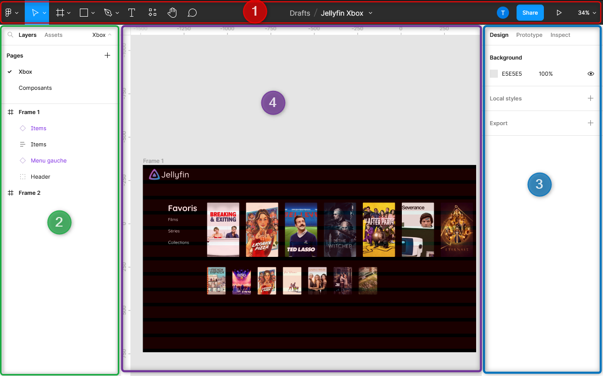

L'interface de Figma est découpée en quatre parties :

1. **Barre du haut** : regroupe le menu principal de l'application et les différents outils nécessaires à la création d'un prototype
2. **Barre de gauche** : permet de naviguer entre les différentes couches (layers) et ressources (assets) et de choisir la page affichée sur la zone de travail
3. **Barre de droite** : zone permettant de modifier les propriétés du ou des éléments sélectionnés dans la zone de travail, permet également de gérer les options de prototypage
4. **Zone de travail (canvas)** : affiche les maquettes en cours de réalisation

## Présentation détaillée de chaque partie de l'interface
<!-- TODO : remplir cette partie -->

### Barre du haut

#### Menu Figma

On retrouve dans ce menu la plupart des actions réalisables dans Figma. La plupart de ces actions sont accessibles à partir d'autres endroits sur l'interface.

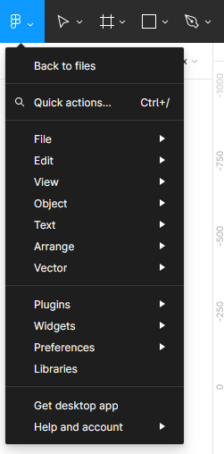

- *Back to files* : permet de retourner sur la page principale de Figma ;
- *Quick actions* : permet de chercher parmi toutes les actions et d'en exécuter une choisie ;
- *File* : permet de créer des nouveau projet Figma, d'importer des images dans le projet actuel et de sauvegarder le projet courant sous différents formats ;
- *Edit* : regroupe les actions suivantes :
  - Revenir en arrière / en avant ;
  - Copier / coller ;
  - Chercher dans le projet ;
  - Sélectionner une couleur (color picker) ;
  - Sélectionner plusieurs selon plusieurs critères.
- *View* : regroupe toutes les options de l'interface ;
- *Object* : actions pouvant être appliquées à des éléments sélectionnés dans la zone principale ;
- *Text* : regroupe les actions réalisables sur du texte
- *Arrange* : regroupe les actions permettant d'aligner ou de distribuer des éléments dans leur conteneur ;
- *Vector* : regroupe les actions de sélections d’éléments vectoriels ;
- *Plugins* : gestion des plugins utilisés sur le projet <!-- Ajouter un lien vers la section plugins -->
- *Widgets* : permet d'ajouter des Widgets au projet en cours (non abordé ici) ;
- *Preferences* : permet de gérer les préférences ;
- *Librairies* : permet de gérer les bibliothèques de composants (payant) ;

#### Menu outils

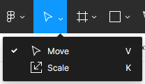

Ce menu permet de choisir un des deux outils suivants :
- *Move* : permet de faire bouger les éléments ;
- *Scale* : permet de redimensionner les éléments.

#### Menu frame

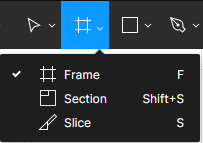

Ce menu permet de choisir entre trois outils :
- *Frame* : permet de créer une frame (élément de base d'un écran) ;
- *Section* : permet de créer des sections afin d'organiser les frames, plus d'informations disponibles [ici](https://help.figma.com/hc/en-us/articles/9771500257687-Organize-your-canvas-with-sections) ;
- *Slice* : permet de créer une *tranche* et d'exporter le résultat de la tranche.

#### Menu figures 

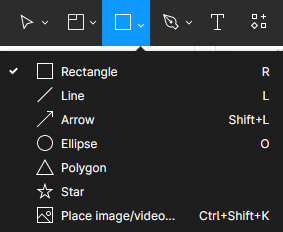

Ce menu permet de choisir parmi les figures suivantes pour créer des éléments : 
- *Rectangle* : rectangle ;
- *Line* : ligne ;
- *Arrow* : flèche ;
- *Ellipse* : ellipse ;
- *Polygon* : polygone ;
- *Star* : étoile ;
- *Image/video* : image ou vidéo.

Ces éléments doivent **toujours** se trouver au sein d'une frame.

#### Menu stylo

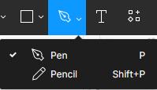

Ce menu permet d'utiliser les deux outils suivants :
- *Stylo* : permet de créer des formes personnalisées et des icons ;
- *Crayon de papier* : permet de dessiner des lignes à main levée.

#### Menu texte

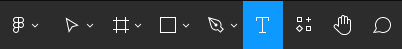

Cet outil permet d'ajouter du texte.

#### Menu ressources

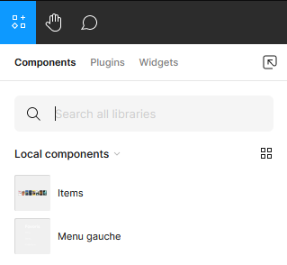

Ce menu permet de parcourir les différentes ressources du projet (composants, plugins et widgets) et de les ajouter dans une frame.

#### Outil main

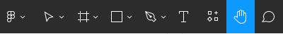

L'outil main permet de déplacer la zone de travail.

#### Outil commentaires

L'outil commentaires permet d'ajouter des commentaires au projet.

### Barre de gauche
<!-- TODO : remplir cette partie -->
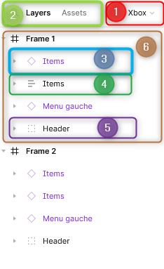

1. Choix de la page affichée sur la page de travail ;
2. Choix entre l'affichage des éléments de la page choisie ou des composants utilisables ;
3. Les éléments en violet sont des instances de composant ;
4. Les éléments avec l’icône des 3 traits signifie que ce sont des composants utilisant l'auto layout ;
5. Cet élément est un groupe d'autres éléments (icône carré en tireté) ;
6. Frame contenant plusieurs éléments.

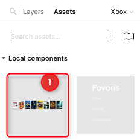

1. Un des composants disponible dans le projet.

### Barre de droite
<!-- TODO : remplir cette partie -->

### Zone de travail
<!-- TODO : remplir cette partie -->

## Principes fondamentaux de Figma
<!-- TODO : trouver un meilleur titre -->

### Découpage du projet

On utilisera le découpage suivant pour tout projet sur Figma :
<!-- TODO : créer les liens vers prototypage et composants -->
- **Une page par type d'appareil** (desktop, smartphone, tablette, ect...) sur lequel l'application sera développée ;
- **Une frame (cadre) par écran** différent dans l'application, certains écran pourront être dupliqués lors du *prototypage* ;
- On pourra créer d'autres pages pour la création de *composants* ;

### Création des maquettes
<!-- TODO : remplir cette partie -->

### Layout Grid

### Utilisation des contraintes
<!-- TODO : remplir cette partie -->

### Utilisation de l'auto layout
<!-- TODO : remplir cette partie -->

### Utilisation des composants
<!-- TODO : remplir cette partie -->

### Prototypage
<!-- TODO : remplir cette partie -->

## Tips and tricks

- Activer les règles dans le sous menu *View* du menu Figma
- Utiliser un maximum le layout Grid en 12 colonnes

## Liens utiles
<!-- TODO : remplir cette partie -->

## Plugins intéressants 

