# Figma <!-- omit from toc -->

Figma est un outil de conception d'interface utilisateur (UI) et d'expérience utilisateur (UX). Il permet de créer des designs interactifs, des maquettes et des prototypes. 

Les prototypes d'interface utilisateur sont un élément clé du processus de développement de logiciels, car ils permettent de valider les idées de conception, de réduire les coûts de développement, de faciliter la communication et de livrer des produits finis de qualité supérieure.

Ci-dessous vous trouverez une documentation vous permettant de découvrir Figma.

# Sommaire <!-- omit from toc -->

- [1. Présentation succincte de l'interface](#1-présentation-succincte-de-linterface)
- [2. Présentation détaillée de chaque partie de l'interface](#2-présentation-détaillée-de-chaque-partie-de-linterface)
  - [2.1. Barre du haut](#21-barre-du-haut)
    - [2.1.1. Menu Figma](#211-menu-figma)
    - [2.1.2. Menu outils](#212-menu-outils)
    - [2.1.3. Menu frame](#213-menu-frame)
    - [2.1.4. Menu figures](#214-menu-figures)
    - [2.1.5. Menu stylo](#215-menu-stylo)
    - [2.1.6. Menu texte](#216-menu-texte)
    - [2.1.7. Menu ressources](#217-menu-ressources)
    - [2.1.8. Outil main](#218-outil-main)
    - [2.1.9. Outil commentaires](#219-outil-commentaires)
  - [2.2. Barre de gauche](#22-barre-de-gauche)
    - [2.2.1. Volet layers](#221-volet-layers)
    - [2.2.2. Volet assets](#222-volet-assets)
  - [2.3. Barre de droite](#23-barre-de-droite)
    - [2.3.1. Volet design](#231-volet-design)
    - [2.3.2. Volet prototype](#232-volet-prototype)
    - [2.3.3. Volet inspect](#233-volet-inspect)
  - [2.4. Zone de travail](#24-zone-de-travail)
- [3. Principes fondamentaux de Figma](#3-principes-fondamentaux-de-figma)
  - [3.1. Découpage d'un projet](#31-découpage-dun-projet)
  - [3.2. Étapes de création d'un prototype](#32-étapes-de-création-dun-prototype)
  - [3.3. Frames et groupes](#33-frames-et-groupes)
  - [3.4. Alignement et distribution des éléments par rapport au parent](#34-alignement-et-distribution-des-éléments-par-rapport-au-parent)
  - [3.5. Taille des éléments](#35-taille-des-éléments)
  - [3.6. Angles des éléments](#36-angles-des-éléments)
  - [Bordures des éléments](#bordures-des-éléments)
  - [3.7. Mise à plat d'éléments (flatten)](#37-mise-à-plat-déléments-flatten)
  - [3.8. Utilisation des contraintes](#38-utilisation-des-contraintes)
  - [3.9. Layout Grid](#39-layout-grid)
  - [3.10. Utilisation de l'auto layout](#310-utilisation-de-lauto-layout)
  - [3.11. Gestion de l'affichage des couches les unes par rapport aux autres](#311-gestion-de-laffichage-des-couches-les-unes-par-rapport-aux-autres)
  - [3.12. Les composants](#312-les-composants)
    - [3.12.1. Création d'un composant](#3121-création-dun-composant)
    - [3.12.2. Les variantes de composant](#3122-les-variantes-de-composant)
    - [3.12.3. La propriété texte sur les composants](#3123-la-propriété-texte-sur-les-composants)
    - [3.12.4. La propriété booléenne sur les composants](#3124-la-propriété-booléenne-sur-les-composants)
    - [3.12.5. La propriété d'échange d'instance sur les composants](#3125-la-propriété-déchange-dinstance-sur-les-composants)
  - [3.13. Gestion du scrolling](#313-gestion-du-scrolling)
  - [3.14. Prototypage](#314-prototypage)
    - [Créer une popup](#créer-une-popup)
  - [3.15. Partage d'un prototype avec un client](#315-partage-dun-prototype-avec-un-client)
- [4. Tips and tricks](#4-tips-and-tricks)
- [5. Liens utiles](#5-liens-utiles)
- [6. Plugins intéressants](#6-plugins-intéressants)

## 1. Présentation succincte de l'interface

L'interface de Figma est découpée en quatre parties :

1. **Barre du haut** : regroupe le menu principal de l'application et les différents outils nécessaires à la création d'un prototype
2. **Barre de gauche** : permet de naviguer entre les différentes couches (layers) et ressources (assets) et de choisir la page affichée sur la zone de travail
3. **Barre de droite** : zone permettant de modifier les propriétés du ou des éléments sélectionnés dans la zone de travail, permet également de gérer les options de prototypage
4. **Zone de travail (canvas)** : affiche les maquettes en cours de réalisation

## 2. Présentation détaillée de chaque partie de l'interface

### 2.1. Barre du haut

#### 2.1.1. Menu Figma

On retrouve dans ce menu la plupart des actions réalisables dans Figma. La plupart de ces actions sont accessibles à partir d'autres endroits sur l'interface.

- *Back to files* : permet de retourner sur la page principale de Figma ;
- *Quick actions* : permet de chercher parmi toutes les actions et d'en exécuter une choisie ;
- *File* : permet de créer des nouveau projet Figma, d'importer des images dans le projet actuel et de sauvegarder le projet courant sous différents formats ;
- *Edit* : regroupe les actions suivantes :
  - Revenir en arrière / en avant ;
  - Copier / coller ;
  - Chercher dans le projet ;
  - Sélectionner une couleur (color picker) ;
  - Sélectionner plusieurs selon plusieurs critères.
- *View* : regroupe toutes les options de l'interface ;
- *Object* : actions pouvant être appliquées à des éléments sélectionnés dans la zone principale ;
- *Text* : regroupe les actions réalisables sur du texte
- *Arrange* : regroupe les actions permettant d'aligner ou de distribuer des éléments dans leur conteneur ;
- *Vector* : regroupe les actions de sélections d’éléments vectoriels ;
- *Plugins* : gestion des plugins utilisés sur le projet <!-- Ajouter un lien vers la section plugins -->
- *Widgets* : permet d'ajouter des Widgets au projet en cours (non abordé ici) ;
- *Preferences* : permet de gérer les préférences ;
- *Librairies* : permet de gérer les bibliothèques de composants (payant) ;

#### 2.1.2. Menu outils

Ce menu permet de choisir un des deux outils suivants :
- *Move* : permet de faire bouger les éléments ;
- *Scale* : permet de redimensionner les éléments.

#### 2.1.3. Menu frame

Ce menu permet de choisir entre trois outils :
- *Frame* : permet de créer une frame (élément de base d'un écran) ;
- *Section* : permet de créer des sections afin d'organiser les frames, plus d'informations disponibles [ici](https://help.figma.com/hc/en-us/articles/9771500257687-Organize-your-canvas-with-sections) ;
- *Slice* : permet de créer une *tranche* et d'exporter le résultat de la tranche.

#### 2.1.4. Menu figures 

Ce menu permet de choisir parmi les figures suivantes pour créer des éléments : 
- *Rectangle* : rectangle ;
- *Line* : ligne ;
- *Arrow* : flèche ;
- *Ellipse* : ellipse ;
- *Polygon* : polygone ;
- *Star* : étoile ;
- *Image/video* : image ou vidéo.

Ces éléments doivent **toujours** se trouver au sein d'une frame.

#### 2.1.5. Menu stylo

Ce menu permet d'utiliser les deux outils suivants :
- *Stylo* : permet de créer des formes personnalisées et des icons ;
- *Crayon de papier* : permet de dessiner des lignes à main levée.

#### 2.1.6. Menu texte

Cet outil permet d'ajouter du texte.

#### 2.1.7. Menu ressources

Ce menu permet de parcourir les différentes ressources du projet (composants, plugins et widgets) et de les ajouter dans une frame.

#### 2.1.8. Outil main

L'outil main permet de déplacer la zone de travail.

#### 2.1.9. Outil commentaires

L'outil commentaires permet d'ajouter des commentaires au projet.

### 2.2. Barre de gauche

#### 2.2.1. Volet layers

1. Choix de la page affichée sur la page de travail ;
2. Choix entre l'affichage des éléments de la page choisie ou des composants utilisables ;
3. Les éléments en violet sont des instances de composant ;
4. Les éléments avec l’icône des 3 traits signifie que ce sont des composants utilisant l'auto layout ;
5. Cet élément est un groupe d'autres éléments (icône carré en tireté) ;
6. Frame contenant plusieurs éléments.

#### 2.2.2. Volet assets

1. Un des composants disponibles dans le projet.

### 2.3. Barre de droite

#### 2.3.1. Volet design

Ce volet permet de modifier les propriétés de style du ou des éléments sélectionnés. On retrouve plusieurs propriétés, chacune détaillée plus loin dans le document.

##### Alignement et distribution des éléments <!-- omit from toc -->

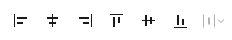

[Alignement et distribution par rapport à la frame parente](#alignement-des-éléments-par-rapport-au-parent)

##### Taille, rotation et angles des éléments <!-- omit from toc -->

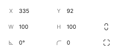

Gestion de [la taille](#34-taille-des-éléments) et [des angles](#35-angles-des-éléments)

##### Auto layout <!-- omit from toc -->

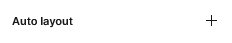

[Gestion de l'auto layout](#39-utilisation-de-lauto-layout)

##### Contraintes de positionnement <!-- omit from toc -->

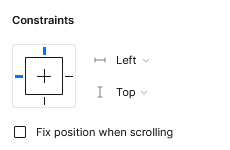

[Gestion des contraintes de positionnement par rapport au parent](#37-utilisation-des-contraintes)

##### Layout grid <!-- omit from toc -->

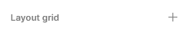

[Gestion du layout grid](#38-layout-grid)

##### Couches <!-- omit from toc -->

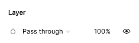

[Gestion de l'affichage des couches les unes par rapport aux autres](#310-gestion-de-laffichage-des-couches-les-unes-par-rapport-aux-autres)

##### Bordures <!-- omit from toc -->

<!-- TODO créer cette partie -->

##### Remplissages <!-- omit from toc -->

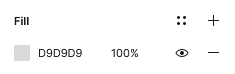

<!-- TODO créer cette partie -->

##### Effets <!-- omit from toc -->

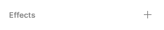

<!-- TODO créer cette partie -->

##### Export <!-- omit from toc -->

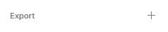

<!-- TODO créer cette partie -->

#### 2.3.2. Volet prototype
<!-- TODO remplir cette partie -->

#### 2.3.3. Volet inspect
<!-- TODO remplir cette partie -->

### 2.4. Zone de travail

C'est ici que s'affichent tous les éléments de la page sélectionnée. 
<!-- TODO à compléter -->

## 3. Principes fondamentaux de Figma
<!-- TODO : trouver un meilleur titre -->

### 3.1. Découpage d'un projet

On utilisera le découpage suivant pour tout projet sur Figma :
<!-- TODO : créer les liens vers prototypage et composants -->
- **Une page par type d'appareil** (desktop, smartphone, tablette, ect...) sur lequel l'application sera développée ;
- **Une frame (cadre) par écran** différent dans l'application, certains écran pourront être dupliqués lors du *prototypage* ;
- On pourra créer d'autres pages pour la création de *composants* ;

### 3.2. Étapes de création d'un prototype
<!-- TODO ajouter des liens vers les autres parties -->
Voici les étapes de base pour créer une maquette sur Figma :

1. Créez un nouveau fichier sur Figma en cliquant sur "New File" dans le coin supérieur gauche de l'écran.
2. Définissez la taille de la maquette en fonction de vos besoins. Vous pouvez sélectionner une taille prédéfinie ou créer une taille personnalisée en utilisant l'outil "Frame" ou en sélectionnant "Custom size" dans le panneau de droite.
<!-- TODO ajouter un gif pour montrer comment faire -->
3. Ajoutez les éléments de base tels que les formes, les images, les boutons et les champs de texte en utilisant les outils de dessin et de texte disponibles dans la barre d'outils de Figma.
4. Utilisez des "components" pour créer des éléments réutilisables tels que des boutons, des icônes et des menus. Les "components" vous permettent de mettre à jour facilement tous les éléments liés lorsqu'un changement est effectué sur l'un d'entre eux.
5. Utilisez les "frames" pour organiser les éléments en fonction de leur placement sur la page. Les "frames" vous permettent également de créer des maquettes pour plusieurs pages ou écrans.
6. Ajoutez des interactions pour créer un prototype de la maquette. Les interactions peuvent inclure des liens vers d'autres pages, des animations et des changements d'état.
7. Partagez la maquette avec votre équipe ou vos clients en utilisant la fonction de partage de Figma. Vous pouvez partager le lien de la maquette ou donner un accès en lecture seule à d'autres utilisateurs.

Il est important de noter que ces étapes peuvent varier en fonction de vos besoins et de la complexité de votre projet. Cependant, en suivant ces étapes de base, vous pouvez créer une maquette fonctionnelle et facile à comprendre sur Figma.

### 3.3. Frames et groupes

Sur Figma, un "group" et une "frame" sont deux éléments de conception différents mais qui peuvent tous deux être utilisés pour organiser des éléments dans un projet de conception.

Un "group" sur Figma est simplement un ensemble d'éléments regroupés ensemble. Il permet de sélectionner, déplacer ou redimensionner plusieurs éléments à la fois. Les éléments regroupés peuvent être des formes, des textes, des images ou d'autres groupes. Les groupes peuvent être créés en sélectionnant plusieurs éléments et en utilisant la commande "grouper" ou en utilisant le raccourci clavier "CMD + G" sur Mac ou "CTRL + G" sur PC.

Les éléments contenus dans un "group" n'ont plus de propriétés de contraintes par rapport à leur conteneur.

Ci-dessous on peut voir comment créer un "group" ainsi que l'effet du redimensionnement du "group" sur ses éléments enfants.

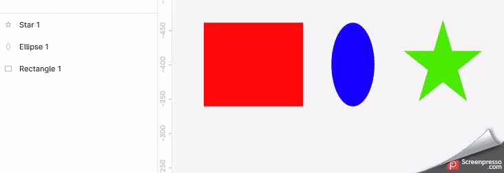

D'un autre côté, une "frame" est un conteneur dans lequel des éléments sont placés. Il est souvent utilisé pour créer des maquettes d'écran ou de page web. La "frame" peut être redimensionnée pour représenter différentes tailles d'écran ou de fenêtre, et elle peut être utilisée pour ancrer des éléments en place. Les éléments peuvent être placés à l'intérieur ou à l'extérieur de la "frame". Pour créer une "frame", vous pouvez utiliser l'outil "frame" dans la barre d'outils de Figma ou utiliser le raccourci clavier "F".

En résumé, un "group" est utilisé pour regrouper plusieurs éléments ensemble pour faciliter leur manipulation, tandis qu'une "frame" est utilisée pour créer un conteneur pour les éléments et les organiser de manière logique.

Il est possible de transformer une "frame" en "group" et vice versa de la façon suivante : 

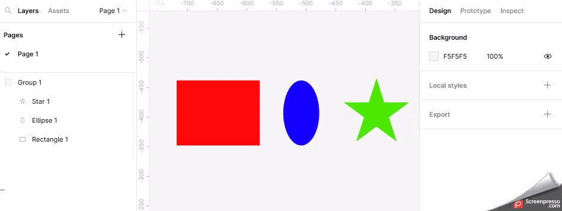

Pour plus d'information vous pouvez également lire [cet article](https://www.figma.com/fr/best-practices/groups-versus-frames/).

### 3.4. Alignement et distribution des éléments par rapport au parent
<!-- TODO : remplir cette partie -->

### 3.5. Taille des éléments 
<!-- TODO remplir cette partie -->

### 3.6. Angles des éléments 
<!-- TODO remplir cette partie -->

### Bordures des éléments

Il est possible d'ajouter des bordures à tous les éléments qui existent. Pour ajouter une bordure à l'élément sélectionné il faut appuyer sur le **+**. Ensuite il est possible de changer certaines propriétés de la bordure :

- la couleur
- l'opacité
- l'emplacement de la bordure par rapport à l'élément :
  - *inside* : la bordure se dessine à l'intérieur de l'élément (conseillé)
  - *outside* : la bordure se dessine à l'extérieur de l'élément
  - *center* : la moitié de la bordure se dessine à l'intérieur de l'élément et l'autre moitié sur l'extérieur
- l'épaisseur

Exemple :
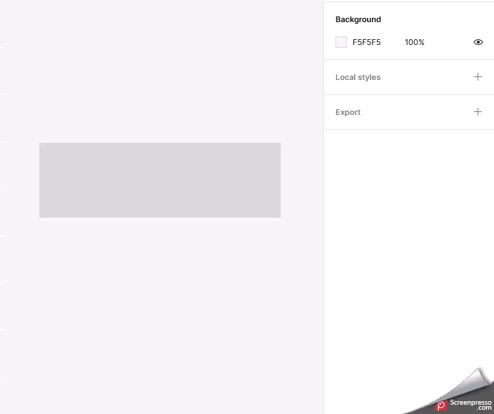

Il existe également d'autres propriétés permettant de créer des bordures encore plus personnalisées en appuyant sur **...** :
- style de la bordure :
  - *solid* : trait plein
  - *dashed* : bordure en tirets, ajouter les propriétés suivantes :
    - *dash* : longueur des tirets
    - *gap* : espace entre les tirets 
    - *dash cap* : forme de l'embout des tirets (**attention** se rajoute à la taille des embouts)
  - *join* : forme des angles

### 3.7. Mise à plat d'éléments (flatten)

Il peut parfois être intéressant de créer un seul élément à partir de plusieurs, pour cela on peut utiliser l'action de mise à plat, "flatten" sur Figma. On peut voir un exemple dans le GIF ci-dessous :

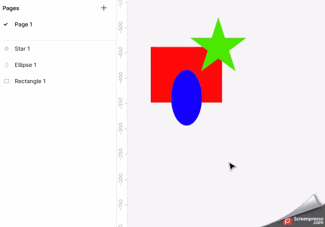

Attention la mise à plat est **action destructive**, c'est à dire qu'il n'est pas possible de revenir en arrière et de séparer les éléments.

### 3.8. Utilisation des contraintes
<!-- TODO ajouter gifs pour montrer l'effet des contraintes -->

Les contraintes sur Figma sont un ensemble d'outils qui permettent de créer des designs flexibles et adaptatifs, capables de s'adapter à différentes tailles d'écran et de résolutions. Les contraintes permettent de définir des règles pour la mise en page et la position des éléments dans une conception. Les contraintes s'applique par rapport à la "frame" parente.

Voici comment fonctionnent les contraintes sur Figma :

1. Tout d'abord, sélectionnez un élément que vous souhaitez ancrer ou positionner. Les éléments pouvant être contraints peuvent être des "frames", des "groups", des "components", des "instances" et même des "textes".
2. Dans le panneau "Properties" sur le côté droit de l'écran, vous verrez une section "Constraints" qui vous permet de définir les contraintes pour l'élément sélectionné.
3. Vous pouvez définir les contraintes en choisissant une option parmi les types de contraintes possibles :
   - La contrainte de gauche : vous permet de fixer la position de l'élément par rapport au bord gauche de son parent.
   - La contrainte de droite : vous permet de fixer la position de l'élément par rapport au bord droit de son parent.
   - La contrainte du haut : vous permet de fixer la position de l'élément par rapport au bord supérieur de son parent.
   - La contrainte du bas : vous permet de fixer la position de l'élément par rapport au bord inférieur de son parent.
   - La contrainte de centre : vous fermer de fixer la position du centre de l'élément par rapport au parent
   - La contrainte d'échelle : vous permet de faire en sorte que l'élément soit automatiquement redimensionné sans que sa position bouge quand les dimensions du parent sont modifiées

Vous pouvez définir les contraintes pour une ou plusieurs des options de contraintes disponibles, selon vos besoins. Par exemple, vous pouvez contraindre un élément pour qu'il reste centré dans son parent en définissant des contraintes pour la gauche et la droite, mais pas pour le haut et le bas.

Vous pouvez également utiliser les contraintes pour définir la taille de l'élément en fonction de son parent. Par exemple, vous pouvez contraindre la hauteur d'un bouton à celle de son parent afin qu'il s'adapte automatiquement à la taille de l'écran.

En utilisant les contraintes de manière appropriée, vous pouvez créer des conceptions adaptables à différents écrans et résolutions, et faciliter la mise à jour et la modification des designs pour votre projet.

### 3.9. Layout Grid
<!-- TODO : ajouter des gifs -->
Le layout grid (grille de mise en page) est un outil de conception disponible sur Figma qui permet de créer et d'ajuster des grilles de mise en page pour aider à organiser les éléments de la conception. La grille de mise en page peut être utilisée pour aligner des éléments, gérer l'espacement, la taille et la proportion des éléments et assurer une cohérence visuelle.

Voici comment fonctionne le layout grid sur Figma :

1. Tout d'abord, sélectionnez l'élément sur lequel vous souhaitez ajouter la grille de mise en page, que ce soit un cadre, un groupe ou un composant.
2. Dans le panneau "Properties" sur le côté droit de l'écran, cliquez sur l'option "Layout Grid" pour afficher les options de grille de mise en page.
3. Vous pouvez choisir parmi différents types de grille de mise en page, tels que "Columns", "Rows", "Grid", "Vertical" ou "Horizontal". Vous pouvez également définir le nombre de colonnes et de lignes, la taille de l'espace entre les éléments, ainsi que la taille des marges.
4. Vous pouvez également ajuster la grille en déplaçant et en redimensionnant les guides de la grille. Les guides de la grille sont des lignes qui vous aident à aligner les éléments sur la grille.
5. Lorsque la grille de mise en page est définie, les éléments sont automatiquement alignés sur les guides de la grille lorsque vous les déplacez ou les redimensionnez. Cela vous permet de créer une mise en page cohérente et organisée.
6. Le layout grid sur Figma est un outil puissant pour les designers qui travaillent sur des projets avec de nombreux éléments à organiser et à aligner. La grille de mise en page facilite la conception de maquettes et assure une cohérence visuelle dans la conception.

### 3.10. Utilisation de l'auto layout
<!-- TODO : ajouter des gifs -->
L'Auto Layout est un outil de mise en page disponible sur Figma qui permet de créer des designs flexibles et adaptatifs en utilisant des contraintes dynamiques. L'Auto Layout est très utile pour créer des interfaces utilisateur complexes, telles que des tableaux de bord, des menus déroulants et des formulaires.

Voici comment utiliser l'Auto Layout sur Figma :

1. Tout d'abord, sélectionnez l'élément que vous souhaitez utiliser avec l'Auto Layout, qu'il s'agisse d'un cadre, d'un groupe ou d'un composant.
2. Dans le panneau "Properties" sur le côté droit de l'écran, cliquez sur l'option "Auto Layout" pour activer l'Auto Layout. Vous verrez des options supplémentaires apparaître.
3. Vous pouvez définir les règles de contraintes dynamiques pour les éléments à l'intérieur de l'Auto Layout, tels que l'alignement vertical et horizontal, les marges et les espacements.
4. Ajoutez des éléments à l'intérieur de l'Auto Layout en les faisant glisser dans le cadre parent. Les éléments ajoutés sont automatiquement alignés et dimensionnés en fonction des règles de contraintes dynamiques définies.
5. Vous pouvez modifier les règles de contraintes dynamiques pour les éléments à l'intérieur de l'Auto Layout en ajustant les propriétés dans le panneau "Properties". Les éléments à l'intérieur de l'Auto Layout peuvent être déplacés et redimensionnés en toute liberté tout en maintenant les contraintes dynamiques.

L'utilisation de l'Auto Layout sur Figma permet de créer des designs plus flexibles et adaptatifs, qui peuvent s'ajuster automatiquement à différentes tailles d'écran et de résolutions. L'Auto Layout est un outil puissant pour les designers qui travaillent sur des projets avec des designs complexes et en constante évolution.

### 3.11. Gestion de l'affichage des couches les unes par rapport aux autres
<!-- TODO remplir cette partie -->

### 3.12. Les composants

#### 3.12.1. Création d'un composant

Les composants sont des éléments de design réutilisables sur Figma. Ils permettent aux designers de créer une conception cohérente et d'appliquer facilement des mises à jour globales à des éléments spécifiques.

Voici comment fonctionnent les composants sur Figma :

1. Tout d'abord, sélectionnez l'élément que vous souhaitez transformer en composant. Cela peut être un groupe, un cadre, une forme ou un texte.
2. Cliquez sur le bouton "Create Component" dans le panneau "Properties" sur le côté droit de l'écran.
3. Figma créera automatiquement un composant à partir de l'élément sélectionné et vous pouvez lui donner un nom.
4. Les composants peuvent être réutilisés sur d'autres pages et fichiers. Pour ajouter un composant à une page, faites-le simplement glisser à partir du panneau "Assets" sur le côté gauche de l'écran.
5. Vous pouvez modifier les composants en double-cliquant dessus. Les modifications apportées à un composant se répercutent automatiquement sur toutes les instances de ce composant. Cela permet de maintenir une conception cohérente et d'appliquer facilement des mises à jour globales à des éléments spécifiques.
6. Les instances de composants peuvent également être personnalisées. Vous pouvez modifier leur taille, leur position et leur couleur, sans affecter le composant d'origine.

Les composants sur Figma sont très utiles pour les designers qui souhaitent créer une conception cohérente et facilement modifiable. Les composants permettent de gagner du temps en réutilisant les éléments de conception et en appliquant des mises à jour globales à des éléments spécifiques.

#### 3.12.2. Les variantes de composant

Les variantes de composants sont une fonctionnalité de Figma qui permet aux designers de créer plusieurs versions d'un même composant, tout en conservant les mêmes fonctionnalités et les mêmes contraintes. Les variantes de composants sont très utiles pour créer des modèles de design flexibles et adaptables, qui peuvent être utilisés pour une variété de cas d'utilisation différents.

Voici comment créer des variantes de composants sur Figma :

1. Tout d'abord, sélectionnez le composant que vous souhaitez modifier en variantes. Vous pouvez sélectionner un composant existant ou créer un nouveau composant.
2. Cliquez sur le bouton "Create Variants" dans le panneau "Properties" sur le côté droit de l'écran.
3. Dans le menu "Variant Properties", vous pouvez ajouter de nouvelles variantes ou modifier des variantes existantes. Vous pouvez également donner un nom à chaque variante pour faciliter leur identification.
4. Une fois que vous avez créé des variantes de composants, vous pouvez modifier les propriétés de chaque variante individuellement. Par exemple, vous pouvez modifier la couleur, la taille ou la police d'une variante sans affecter les autres variantes.
5. Les variantes de composants peuvent être utilisées de la même manière que les composants standard. Vous pouvez les faire glisser sur la page de conception, les dupliquer, les modifier et les utiliser dans d'autres fichiers.
6. Vous pouvez également utiliser les variantes de composants pour créer des interactions et des animations. Par exemple, vous pouvez créer des boutons avec des variantes de texte pour les états "survolé" et "enfoncé".

En utilisant les variantes de composants sur Figma, vous pouvez créer des designs plus flexibles et adaptables, qui peuvent être utilisés pour une variété de cas d'utilisation différents. Les variantes de composants permettent également de gagner du temps en créant plusieurs versions d'un composant sans avoir à recréer chaque version individuellement.

#### 3.12.3. La propriété texte sur les composants
<!-- TODO remplir cette partie -->

#### 3.12.4. La propriété booléenne sur les composants
<!-- TODO remplir cette partie -->

#### 3.12.5. La propriété d'échange d'instance sur les composants
<!-- TODO remplir cette partie -->

### 3.13. Gestion du scrolling
<!-- TODO remplir cette partie -->

### 3.14. Prototypage
<!-- TODO : remplir cette partie -->
Pour prototyper sur Figma, suivez les étapes suivantes :

1. Créez une maquette de votre design en utilisant les outils de conception de Figma.
2. Lorsque votre maquette est prête, cliquez sur le bouton "Prototype" dans la barre d'outils en haut de la fenêtre Figma.
3. Définissez les interactions entre les différents éléments de votre design en cliquant sur l'un des éléments de votre maquette, puis en faisant glisser une flèche vers l'élément suivant que vous souhaitez lier.
4. Dans le panneau "Prototype" situé à droite de la fenêtre Figma, vous pouvez personnaliser les transitions, les animations et les déclencheurs de vos interactions.
5. Vous pouvez également ajouter des liens vers des pages ou des écrans externes en utilisant l'option "URL" dans le panneau "Prototype".
6. Lorsque votre prototype est prêt, cliquez sur le bouton "Play" dans le coin supérieur droit de la fenêtre Figma pour lancer votre prototype.
7. Testez votre prototype en cliquant sur les éléments interactifs et en naviguant entre les différentes pages ou écrans.
8. Vous pouvez également partager votre prototype avec d'autres personnes en utilisant l'option "Partager" dans la barre d'outils en haut de la fenêtre Figma.

En utilisant les outils de prototypage de Figma, vous pouvez créer des prototypes interactifs de vos designs, ajouter des animations et des transitions pour améliorer l'expérience utilisateur, et partager facilement vos prototypes avec d'autres personnes.

#### Créer une popup

<!-- TOTO améliorer la phrase -->
Il est possible de faire apparaître des Frames sur d'autres Frames en suivant la procédure expliquée [ici](https://scribehow.com/shared/Figma_Workflow__60nweKA1QYm_2tqlqXx40A).

### 3.15. Partage d'un prototype avec un client
<!-- TODO remplir cette partie -->

## 4. Tips and tricks

- Activer les règles dans le sous menu *View* du menu Figma
- Utiliser un maximum le layout Grid en 12 colonnes (12 est divisible par 2, 3, 4 et 6)
- Vous pouvez redimensionner des éléments sans que les contraintes des autres éléments soient prises en compte en maintenant la touche **CTRL** pendant le redimensionnement de l'élément
<!-- TODO ajouter un gif -->

## 5. Liens utiles
<!-- TODO : remplir cette partie -->
[Page d'aide principale](https://help.figma.com/hc/en-us)

[Page Youtube de Figma](https://www.youtube.com/@Figma)

## 6. Plugins intéressants

<!-- TODO créer cette partie -->

